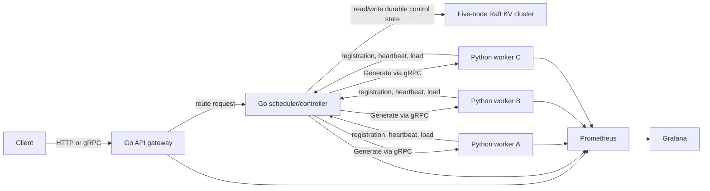

# Fault-Tolerant Distributed LLM Inference Platform

A learning-focused distributed inference system that uses a Raft-based key-value
store as its strongly consistent control-plane database. The platform will combine
a Go control plane with Python inference workers, gRPC service contracts, failure
recovery, load-aware routing, dynamic batching, and production-style observability.

This repository is the next step after the
[Distributed Key-Value Store](https://github.com/jiholee5217/distributed-kv-store):
instead of implementing a storage primitive in isolation, it uses that primitive
to coordinate a distributed ML serving system.

> **Status:** Phase 0 — architecture and API contracts. No throughput, latency,
> fault-tolerance, or production-readiness claims are made yet.

## Why this project exists

The engineering question is not merely "can a model return text?" It is:

> How should a control plane place and route inference work when workers join,
> become overloaded, deploy a new model version, or disappear mid-request?

The project is designed to make those decisions visible, testable, and measurable.

## Planned architecture



### Responsibility boundaries

| Component | Language | Responsibility |
| --- | --- | --- |
| API gateway | Go | Validate requests, assign request IDs, enforce deadlines, expose the client API |
| Scheduler/controller | Go | Track worker health and load, choose workers, reconcile deployments, recover from failures |
| Inference worker | Python | Load a model, queue work, form dynamic batches, execute inference, report capacity |
| Raft KV cluster | Go | Persist durable control-plane state with strongly consistent reads and writes |
| gRPC contracts | Protobuf | Define versioned gateway, controller, and worker communication |
| Observability | Prometheus/Grafana | Record latency, queue depth, batch size, retries, failures, and worker health |

Not every heartbeat should become a Raft write. Durable facts such as worker
identity, generation, desired deployment, and status transitions belong in the
KV store; high-frequency liveness and load samples stay in controller memory.
This avoids turning the single Raft leader into a heartbeat bottleneck while still
making important control decisions recoverable.

## Build sequence

1. **Vertical slice:** one Go gateway/controller, one Python worker, one unary
   gRPC inference call, and a deterministic fake model.
2. **Worker lifecycle:** registration, heartbeats, leases, readiness, and
   load-aware routing across multiple workers.
3. **Dynamic batching:** worker-side queues with maximum batch size and maximum
   queue-delay controls.
4. **Failure recovery:** heartbeat timeouts, routing exclusion, bounded retries,
   request IDs, and worker restart tests.
5. **Observability and load:** Prometheus metrics, Grafana dashboards, and k6 or
   Locust experiments with recorded environments and reproducible results.
6. **Rolling deployments:** version-aware placement, drain/readiness behavior,
   rollback, then an optional Kubernetes deployment.

See [the detailed roadmap](docs/roadmap.md),
[the architecture notes](docs/architecture.md), and
[ADR 0001](docs/adr/0001-control-plane-state.md).

## Repository layout

```text
api/                 Versioned protobuf contracts
docs/                Architecture, decisions, and milestone definitions
gateway/             Go client-facing API (planned)
controller/          Go scheduler and reconciler (planned)
worker/              Python inference worker (planned)
deploy/              Docker, dashboards, and later Kubernetes manifests (planned)
loadtest/             k6 or Locust scenarios (planned)
```

## Ground rules

- Implement one measurable milestone at a time.
- Start with a fake model so distributed-systems behavior can be tested cheaply.
- Add a real small model only after routing and failure semantics work.
- Treat retries, deadlines, cancellation, and idempotency as explicit protocol choices.
- Record benchmark hardware, workload, model, concurrency, and configuration.
- Keep README and resume claims limited to behavior demonstrated by tests or tooling.

## License

[MIT](LICENSE)
