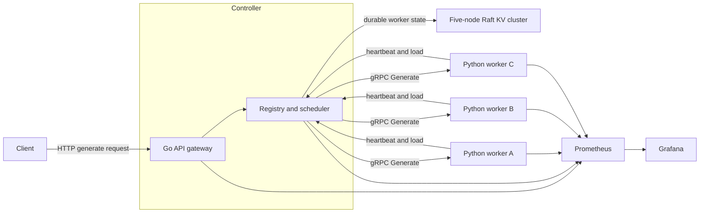

# Fault-Tolerant Distributed LLM Inference Platform

I built this project to learn how distributed inference systems coordinate
requests across multiple workers and recover when those workers fail. It is a
fault-tolerant inference platform with a Go control plane, Python gRPC workers,
dynamic batching, load-aware routing, and a five-node Raft key-value store for
durable control-plane state.

This project builds directly on my
[Distributed Key-Value Store](https://github.com/jiholee5217/distributed-kv-store).
The KV store is the consensus primitive; this repository shows how I used it as
part of a larger system.

## The short version

- Workers register, heartbeat, advertise capacity, drain, and eventually expire.
- The scheduler routes by normalized load and reserves capacity before dispatch.
- Retries are bounded and sent to a different worker when possible.
- Each Python worker has a bounded queue and forms batches by size or deadline.
- Durable lifecycle changes go through Raft; fast-changing load stays in memory.
- Prometheus, Grafana, Locust, and failure scripts make behavior measurable.

The current worker uses a deterministic fake model. That keeps the experiments
cheap and repeatable while isolating the routing, batching, and recovery logic.
It is not presented as a GPU or real-model benchmark.

## Architecture



### What happens to one request

1. The gateway validates the request, assigns an ID, and applies a deadline.
2. The scheduler filters out expired, draining, or incompatible workers.
3. It compares `(active + queued + reserved) / max_concurrency` and reserves a
   slot on the least-loaded candidate.
4. The controller calls that worker over gRPC.
5. The worker admits the request only if its bounded queue has room, then forms
   a batch when the size or queue-delay limit is reached.
6. If the queue is full or dispatch fails, the controller releases its
   reservation and can retry a different worker within the original deadline.

Generation numbers fence stale worker processes. A restarted worker cannot keep
updating the lease created by its previous process, and expired workers are
removed from scheduling before their lifecycle change is written to Raft.

The [diagram gallery](docs/diagrams.md) has separate views for request routing,
worker failure, control-state ownership, and the planned rollout lifecycle.

## Why some state goes through Raft and some does not

Worker identity, generation, and lifecycle transitions need one durable order,
so the controller stores them in the Raft cluster. Heartbeats, queue depth, and
active-request counts change too quickly to justify a consensus write every few
seconds, so they stay in controller memory.

That split is intentional: Raft protects the facts that must survive, while the
scheduler treats load as a short-lived signal. The full decision is documented
in [ADR 0001](docs/adr/0001-control-plane-state.md).

## Results from my test environment

I ran the published Docker topology on an Apple M1 Pro with three workers, 32
Locust users, and a fake model that costs 20 ms per batch.

| Experiment | Throughput | p95 latency | Client failures |
| --- | ---: | ---: | ---: |
| Maximum batch size 1 | 101.98 req/s | 400 ms | 0 |
| Dynamic batches up to 8 | 686.37 req/s | 48 ms | 0 |
| Stop one worker during load | 704.59 req/s | 55 ms | 0 of 10,437 |

In the controlled batching comparison, dynamic batching improved throughput by
**6.73x** and reduced p95 latency by **88%**. In the failure run, killing one
worker caused three transparent retries and one Raft-committed lease expiration,
with no client-visible failures.

These numbers measure the serving architecture around a deterministic workload;
they do not say anything about transformer quality, token throughput, or GPU
performance. The [results report](docs/results/2026-08-15-fake-model.md) includes
the exact configuration, commands, and limitations.

## Run it locally

You only need Docker with Compose:

```bash
docker compose up --detach --build
```

Send a request through the gateway:

```bash
curl -sS -X POST http://127.0.0.1:8090/v1/generate \
  -H 'Content-Type: application/json' \
  -d '{"request_id":"demo-1","prompt":"distributed inference works","timeout_ms":3000}'
```

Prometheus is available at <http://127.0.0.1:9090>, and Grafana is available at
<http://127.0.0.1:3000> with its dashboard already provisioned.

## Put it under load and break a worker

The repository includes the same experiments used for the recorded results:

```bash
./scripts/load-test.sh
./scripts/failure-demo.sh
```

The failure demo starts traffic, stops a worker, waits for its lease to expire,
and verifies that the remaining workers keep serving requests. See the
[operations guide](docs/operations.md) for the full workflow and shutdown steps.

## How I tested it

The Go tests cover worker generations, lease expiration, capacity reservations,
load-aware routing, retry selection, deadlines, metrics, and the Raft client.
The Python tests cover bounded admission, retryable overload responses,
timer-triggered batches, maximum batch size, registration, heartbeats, and
graceful draining.

The full integration path runs:

- one Go gateway/controller;
- three Python gRPC workers;
- the real five-node Raft KV cluster;
- Prometheus and Grafana; and
- Locust traffic with worker fault injection.

The [results report](docs/results/2026-08-15-fake-model.md) records the test
environment so the performance claims can be reproduced instead of treated as
unexplained headline numbers.

## Finding your way around

```text
api/                    Versioned protobuf contracts
cmd/controller/         Go service entrypoint
internal/controlplane/  Registry, scheduler, retries, Raft client, API, metrics
worker/                 Python gRPC worker, batch queue, heartbeats, and tests
deploy/                 Container builds, Prometheus, and Grafana
loadtest/               Locust workload
scripts/                Protobuf, load-test, and failure helpers
docs/                   Architecture, diagrams, operations, ADRs, and results
```

Useful next reads:

- [Architecture](docs/architecture.md) for component boundaries and failure behavior
- [Failure semantics](docs/failure-semantics.md) for retries and unknown outcomes
- [Diagram gallery](docs/diagrams.md) for request, recovery, and state flows
- [Recorded results](docs/results/2026-08-15-fake-model.md) for the full methodology
- [Roadmap](docs/roadmap.md) for the next milestones
- [Protobuf contract](api/inference/v1/inference.proto) for the worker API

## Tradeoffs and next steps

- The fake model is useful for controlled systems tests, but a real model runtime
  still needs token-aware and memory-aware admission control plus GPU metrics.
- The controller is currently a single process. Raft keeps its durable data
  consistent, but controller high availability is not implemented yet.
- A lost gRPC response can cause duplicate compute on retry; execution is not
  exactly once.
- Transport inside the Docker network is unauthenticated.
- Streaming responses, rolling model deployments, and Kubernetes orchestration
  remain future work.

## License

[MIT](LICENSE)
