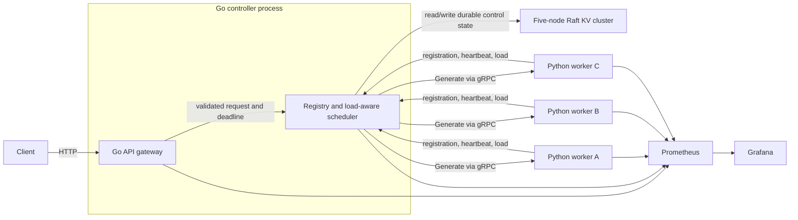

# Fault-Tolerant Distributed LLM Inference Platform

A fault-tolerant distributed inference system that uses a Raft-based key-value
store as its strongly consistent control-plane database. A Go gateway/controller
routes requests to dynamic-batching Python workers over gRPC and exposes the
system through Prometheus, Grafana, Docker Compose, and Locust fault experiments.

This repository is the next step after the
[Distributed Key-Value Store](https://github.com/jiholee5217/distributed-kv-store):
instead of implementing a storage primitive in isolation, it uses that primitive
to coordinate a distributed ML serving system.

> **Status:** Milestones 1-5 are implemented for a deterministic fake model:
> routing, batching, worker failure recovery, metrics, Docker orchestration, and
> load tests. Real model execution, streaming, controller HA, rolling deployments,
> and Kubernetes remain roadmap work.

## 60-second project tour

| Question | Answer |
| --- | --- |
| What problem does it solve? | Routes inference requests across workers that can join, report load, drain, or fail. |
| What makes it a distributed-systems project? | Scheduling decisions combine strongly consistent desired state with rapidly changing worker liveness and load. |
| Why use the Raft KV store? | It gives the controller one durable ordering for registrations, generations, and lifecycle transitions. |
| What stays out of Raft? | High-frequency heartbeats and load samples, because consensus would make them expensive and they become stale quickly. |
| Where does batching happen? | Inside each Python worker, which owns its model runtime and request-compatibility rules. |
| How is it evaluated? | Unit and race tests, a live five-node Raft integration, reproducible Locust runs, fault injection, and Prometheus metrics. |

### Current evidence

| Area | Status | Evidence |
| --- | --- | --- |
| Go control plane | Implemented and tested | [`internal/controlplane`](internal/controlplane) |
| Dynamic-batching worker | Implemented and tested | [`worker`](worker) |
| Raft-backed lifecycle state | Live integration verified | [Architecture](docs/architecture.md) and [ADR 0001](docs/adr/0001-control-plane-state.md) |
| Metrics and dashboards | Provisioned in Docker | [Operations guide](docs/operations.md) |
| Benchmarks and worker failure | Reproduced and recorded | [Results](docs/results/2026-08-15-fake-model.md) |

## Why this project exists

The engineering question is not merely "can a model return text?" It is:

> How should a control plane place and route inference work when workers join,
> become overloaded, deploy a new model version, or disappear mid-request?

The project is designed to make those decisions visible, testable, and measurable.

## System at a glance



### Responsibility boundaries

| Component | Language | Responsibility |
| --- | --- | --- |
| API gateway | Go | Validate requests, assign request IDs, enforce deadlines, expose the client API |
| Scheduler/controller | Go | Track leases and load, reserve capacity, choose distinct retry workers, persist lifecycle transitions |
| Inference worker | Python | Queue compatible work, form bounded-delay batches, execute the current fake model, report capacity |
| Raft KV cluster | Go | Persist durable control-plane state with strongly consistent reads and writes |
| gRPC contracts | Protobuf | Define versioned gateway, controller, and worker communication |
| Observability | Prometheus/Grafana | Record latency, queue depth, batch size, retries, failures, and worker health |

Not every heartbeat should become a Raft write. Durable facts such as worker
identity, generation, and status transitions belong in the
KV store; high-frequency liveness and load samples stay in controller memory.
This avoids turning the single Raft leader into a heartbeat bottleneck while still
making important control decisions recoverable.

For request, failure-recovery, state-ownership, and rollout views, see the
[diagram gallery](docs/diagrams.md).

## Measured fake-model results

On the recorded Apple M1 Pro environment with three workers, a 20 ms fake-model
batch cost, and 32 Locust users:

| Experiment | Throughput | p95 | Failures |
| --- | ---: | ---: | ---: |
| Batch size 1 | 101.98 req/s | 400 ms | 0 |
| Dynamic batch up to 8 | 686.37 req/s | 48 ms | 0 |
| Stop one worker during load | 704.59 req/s | 55 ms | 0 of 10,437 |

Dynamic batching delivered **6.73x throughput** in the controlled comparison.
The failure run recorded three transparent retries and one Raft-committed lease
expiry. These are fake-model control-plane measurements, not GPU or transformer
benchmarks. See the [full methodology and limitations](docs/results/2026-08-15-fake-model.md).

## Run it

```bash
docker compose up --detach --build
curl -sS -X POST http://127.0.0.1:8090/v1/generate \
  -H 'Content-Type: application/json' \
  -d '{"request_id":"demo-1","prompt":"distributed inference works","timeout_ms":3000}'
```

Then open Prometheus at <http://127.0.0.1:9090> or the provisioned Grafana
dashboard at <http://127.0.0.1:3000>. See [operations](docs/operations.md) for
load testing, fault injection, and safe shutdown.

## Documentation map

| Start here | What it answers |
| --- | --- |
| [Hiring-manager project tour](docs/project-tour.md) | What is technically interesting, what exists today, and how the work will be proved |
| [Diagram gallery](docs/diagrams.md) | How requests, control state, failure recovery, and rolling deployments fit together |
| [Architecture](docs/architecture.md) | Where responsibilities live and what failure semantics the system targets |
| [ADR 0001](docs/adr/0001-control-plane-state.md) | Why durable facts use Raft while live load stays in memory |
| [Failure semantics](docs/failure-semantics.md) | What retries guarantee and why execution is not exactly once |
| [Operations](docs/operations.md) | How to run, observe, load test, and inject a worker failure |
| [Recorded results](docs/results/2026-08-15-fake-model.md) | Exact environment, methodology, results, and limitations |
| [Roadmap](docs/roadmap.md) | Milestones, demonstrations, and exit criteria |
| [Protobuf contract](api/inference/v1/inference.proto) | The initial controller-to-worker protocol |

## Repository layout

```text
api/                 Versioned protobuf contracts
cmd/controller/      Go service entrypoint
internal/controlplane/ Registry, scheduler, retries, Raft client, HTTP API, metrics
worker/              Python gRPC service, batching queue, heartbeats, tests
deploy/              Container builds, Prometheus, and Grafana provisioning
loadtest/             Locust workload
scripts/              Protobuf generation, load test, and failure demo
```

## Ground rules

- Implement one measurable milestone at a time.
- Start with a fake model so distributed-systems behavior can be tested cheaply.
- Add a real small model only after routing and failure semantics work.
- Treat retries, deadlines, cancellation, and idempotency as explicit protocol choices.
- Record benchmark hardware, workload, model, concurrency, and configuration.
- Keep README and resume claims limited to behavior demonstrated by tests or tooling.

## Honest limitations

- The current model is deterministic fake inference; no GPU runtime is integrated.
- The controller is a single process and does not yet coordinate active replicas.
- Unary retries can duplicate compute after an unknown transport outcome; they do
  not provide exactly-once execution.
- Transport is unauthenticated inside the Docker network.
- Rolling model deployments, streaming, real-model batching compatibility, and
  Kubernetes are not implemented.

## License

[MIT](LICENSE)
