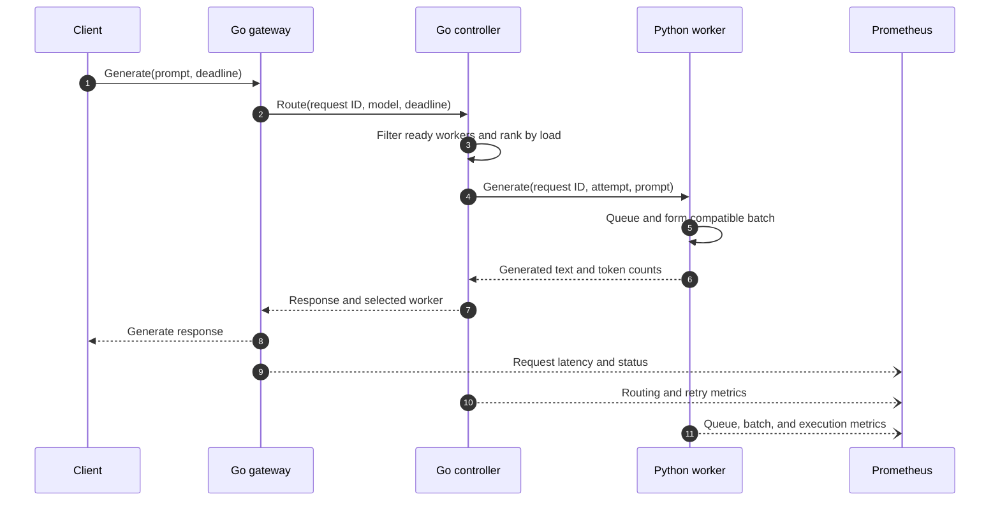
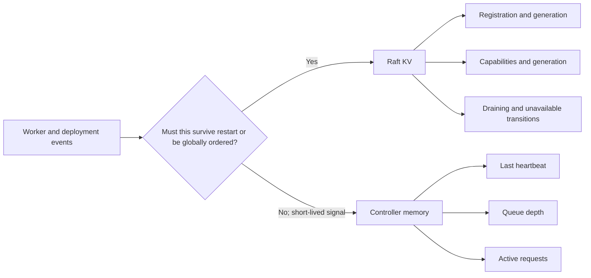
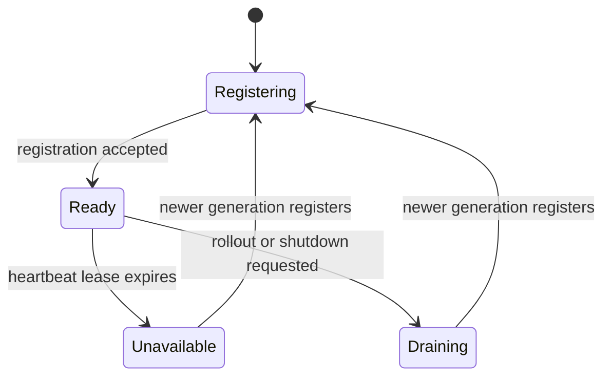

# Architecture

## System boundary

The current milestone is a control-plane and scheduling project, not a new model
runtime. Python workers execute a deterministic fake model with configurable
batch execution time. That keeps tests fast and makes routing, batching,
timeouts, and recovery observable without GPU availability becoming a
prerequisite. A real model backend is the next runtime milestone.

## Request path

1. The gateway validates a request, assigns a stable request ID, and establishes
   an end-to-end deadline.
2. The controller filters workers by model, version, readiness, and heartbeat
   freshness.
3. A load-aware policy ranks eligible workers using queue depth, active requests,
   and reported capacity.
4. The controller reserves capacity locally, calls the selected worker over gRPC,
   and propagates the deadline. Transport cancellation stops the controller's
   wait; immediate removal of already queued worker work remains a roadmap item.
5. The worker rejects the request before admission if its queue is full.
   Otherwise, it forms a batch within configured size and delay limits, runs
   inference, and returns a response.
6. Each service records latency and failure metrics using the same request ID.



## Control-plane state

### Durable and strongly consistent

The Raft KV store holds state that must survive controller restarts or be
observed in one agreed order. The implemented records are:

- worker identity and generation
- model/version capabilities declared at registration
- lifecycle transitions to draining or unavailable

The current KV API accepts one path segment per key, so records use dot-separated
namespaces:

```text
workers.{worker_id}.registration
workers.{worker_id}.status
```

Desired deployment state, rollout generations, routing configuration, and any
idempotency records are deliberately deferred until their reconciliation
semantics are implemented.

### Ephemeral and high-frequency

The controller keeps heartbeat timestamps, queue depth, active request count,
and short-lived load samples in memory. A controller restart rebuilds this view
from fresh worker registrations and heartbeats. Only meaningful lifecycle
transitions are written through Raft.

This split is necessary because the existing KV system is one Raft group: its
leader serializes writes. Writing every heartbeat would consume consensus
capacity without adding a useful durability guarantee.



## Dynamic batching

Batching belongs in the Python worker because it owns the model runtime and can
decide which requests are compatible. The implemented policy exposes three knobs:

- `max_batch_size`: upper bound on requests in one execution
- `max_queue_depth`: upper bound on requests waiting for execution
- `max_queue_delay_ms`: upper bound on how long the oldest request waits for a batch

The worker flushes when the batch reaches its size limit or the oldest queued
request reaches its delay limit. A full queue fails admission immediately with
gRPC `ResourceExhausted`, which the controller can retry on a different worker.
This bounds queued Python objects and waiting futures by request count; a real
runtime still needs token- and GPU-memory-aware limits. Metrics expose observed
batch size, queue wait, execution time, queue depth, admission rejections, and
end-to-end latency.

The gRPC server separately caps concurrent RPCs at `max_concurrency`, matching
the capacity advertised to the controller. The queue limit is intentionally
lower in the Docker topology so saturated handlers can reject excess work
without waiting behind the model thread.

## Load-aware scheduling

Eligible workers are ranked by a capacity-normalized load score:

```text
(active_requests + queue_depth + controller_reservations) / max_concurrency
```

Controller-side reservations are included before the gRPC call starts so a
burst of concurrent requests does not all observe the same stale heartbeat and
stampede one worker. Worker ID provides a deterministic tie-breaker. Retries
exclude workers already attempted for the request.

## Failure semantics

- A worker becomes ineligible after its heartbeat lease expires.
- A full worker queue returns `ResourceExhausted` before execution begins; the
  controller treats that status as retryable and excludes the saturated worker
  from the next attempt.
- In-flight unary requests receive bounded retries for retryable transport and
  capacity failures while the deadline permits. Because an unavailable response
  can have an unknown execution outcome, retries can duplicate computation; the
  API does not claim exactly-once inference.
- Streaming retries require a separate resume or deduplication protocol and are
  intentionally postponed.
- Each retry uses the same request ID and emits an attempt number.
- Draining workers remain alive for admitted work but receive no new requests.
- After a controller restart, workers re-register and re-establish the ephemeral
  liveness view. Durable Raft records remain available for audit; automatically
  replaying them into controller memory is a later reconciliation milestone.



## Initial deployment topology

Docker Compose runs:

- five existing Raft KV nodes
- one Go gateway/controller process initially
- three Python workers
- Prometheus
- Grafana

Controller high availability is a later milestone. Before adding replicas, the
project must define leader election or ownership of reconciliation work so two
controllers do not issue conflicting actions.
