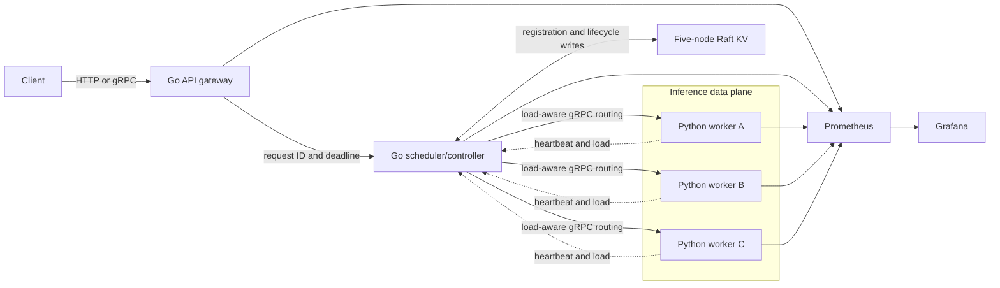
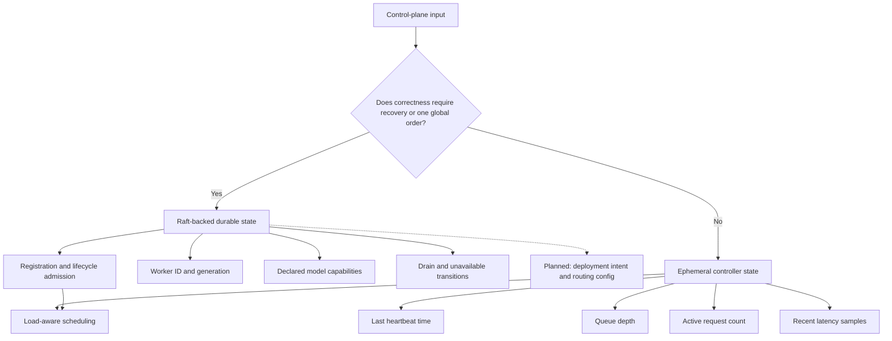
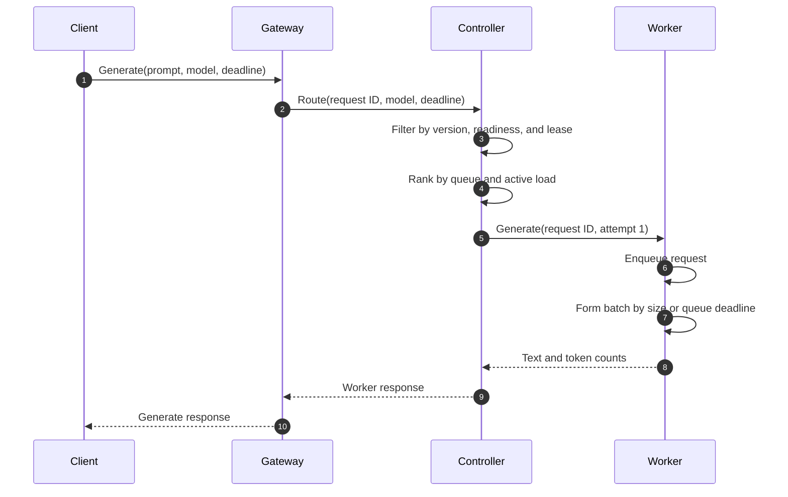
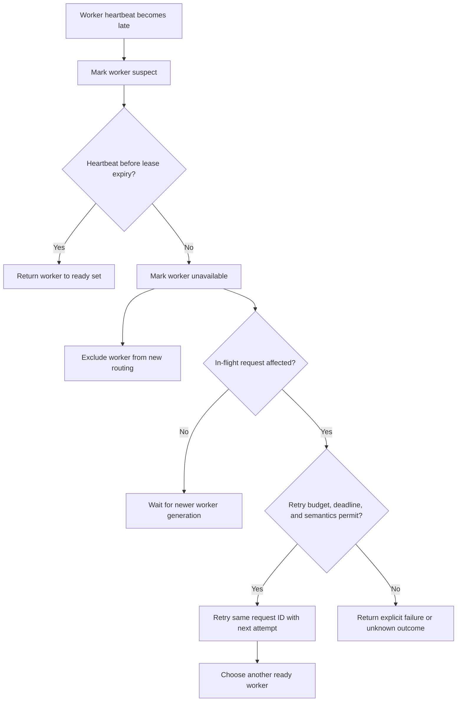
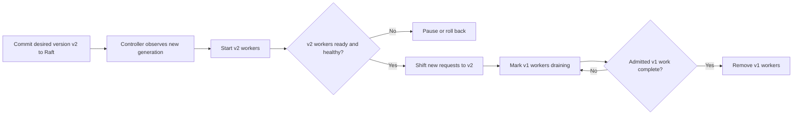
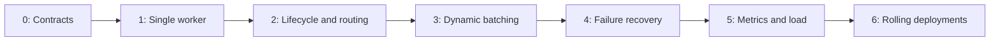

# Diagram gallery

Diagrams 1-4 describe the implemented fake-model runtime. Diagram 5 is explicitly
the planned rolling-deployment extension. The [roadmap](roadmap.md) and
[evidence ledger](project-tour.md#evidence-ledger) separate demonstrated behavior
from future design.

## 1. System context

The client-facing Go gateway owns API concerns. The controller owns placement,
routing, and recovery decisions. Python workers own model execution and batching.
The existing five-node Raft cluster stores durable control-plane state.

## 2. Durable state versus live routing state

The most important control-plane decision is what deserves a consensus write.
Recoverable intent uses Raft; fast-changing observations remain in memory and
must be refreshed after a controller restart.

## 3. Normal request lifecycle

The end-to-end deadline and request ID cross every service boundary. Batching is
worker-local; the controller does not need model-runtime knowledge.

## 4. Worker failure and bounded recovery

There are two distinct failure paths. New requests stop routing to a worker when
its lease expires. An in-flight request is retried only when its deadline and the
documented retry semantics allow another attempt.

## 5. Planned rolling model deployment

The controller reconciles durable desired state rather than mutating every worker
at once. A new version receives traffic only after readiness; old workers drain
admitted work before removal.

## 6. Milestone progression

Each stage adds one new distributed-systems concern while preserving a runnable
vertical slice.

